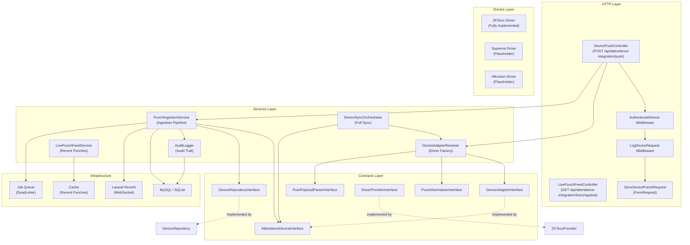

# 1. System Architecture

## Overview

The Attendance Integration Module provides a vendor-independent abstraction layer for connecting fingerprint/biometric attendance devices to the HRM system. It implements a **Driver Pattern** with strict **Dependency Inversion**: the application core depends on contracts (interfaces), while vendor-specific implementations live in isolated driver packages.

## Principles

1. **Single Source of Truth** — One ingestion pipeline from device to database
2. **Vendor Independence** — Core attendance logic never references any vendor
3. **Clean Architecture** — Controller → Service → Contract → Driver
4. **SOLID** — Every class has a single responsibility; dependencies flow toward abstractions
5. **Security by Default** — Authentication, rate limiting, validation on every request

## Architecture Diagram



## Layer Responsibilities

| Layer | Responsibility | Never |
|---|---|---|
| **HTTP** | Request handling, validation, authentication, response formatting | Business logic, DB queries |
| **Services** | Business logic, orchestration, audit | Vendor-specific code |
| **Contracts** | Interface definitions only | Implementation |
| **Drivers** | Vendor-specific communication, parsing, normalization | Business rules |

## Data Flow

```
Device → AuthenticateDevice → StoreDevicePunchRequest → DevicePushController
  → DeviceAdapterResolver → ZKTecoAdmsParser → ZKTecoPunchNormalizer
  → PunchIngestionService → Database + Audit + Broadcast + DeadLetter Queue
```

## Key Design Patterns

| Pattern | Implementation |
|---|---|
| **Strategy** | `DeviceAdapterInterface` — swappable drivers |
| **Factory** | `DeviceAdapterResolver` — creates driver instances |
| **Repository** | `DeviceRepositoryInterface` — abstracts data access |
| **Observer** | `PunchReceived` event → `PublishLivePunchEvent` listener |
| **Decorator** | `LogDeviceRequest` middleware wraps requests with logging |
| **Chain of Responsibility** | Middleware pipeline: Log → Auth → Validate → Controller |
