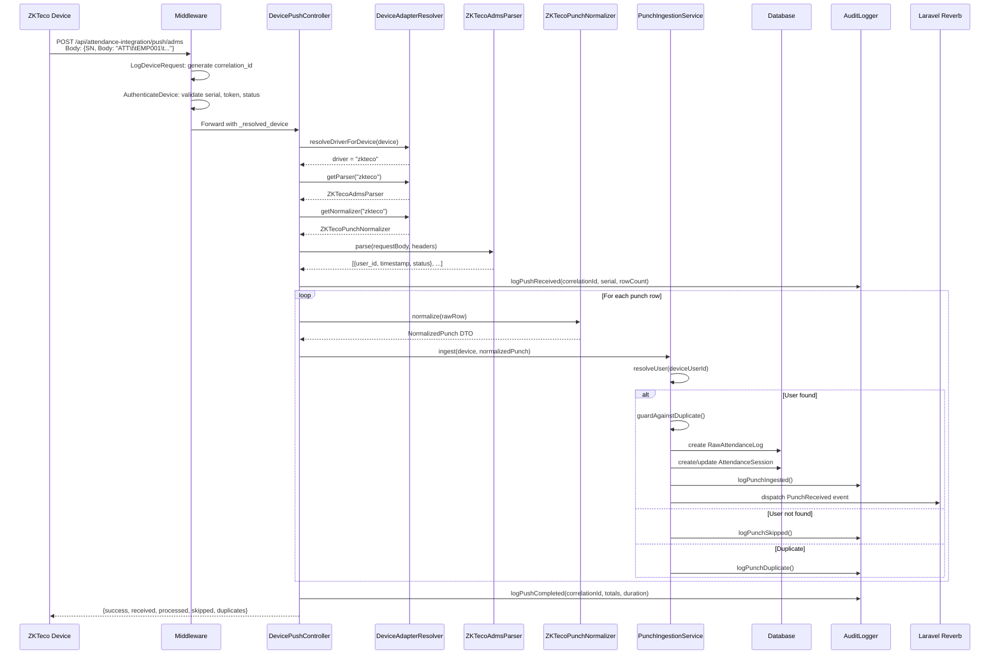
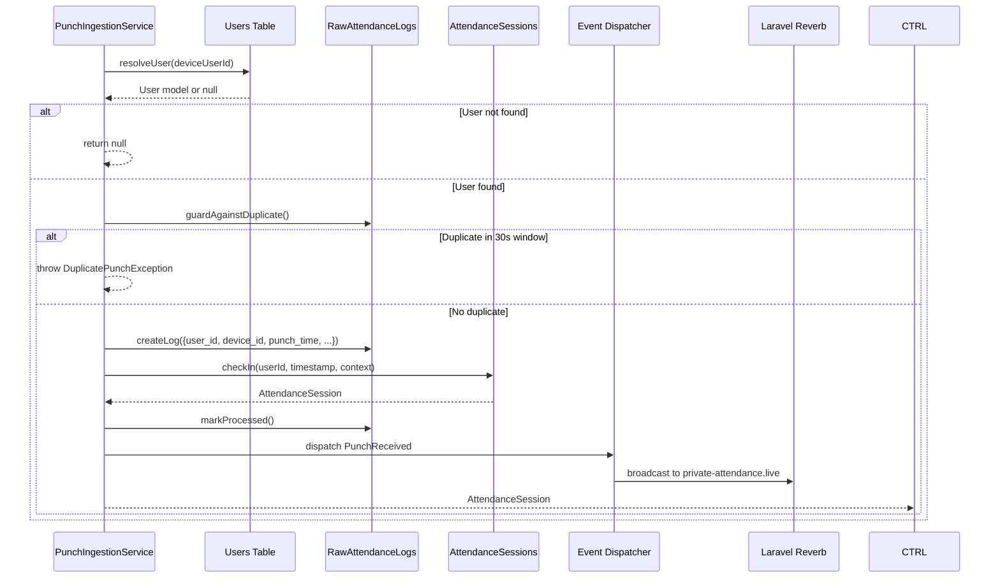
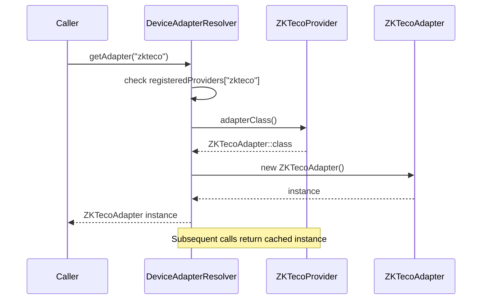
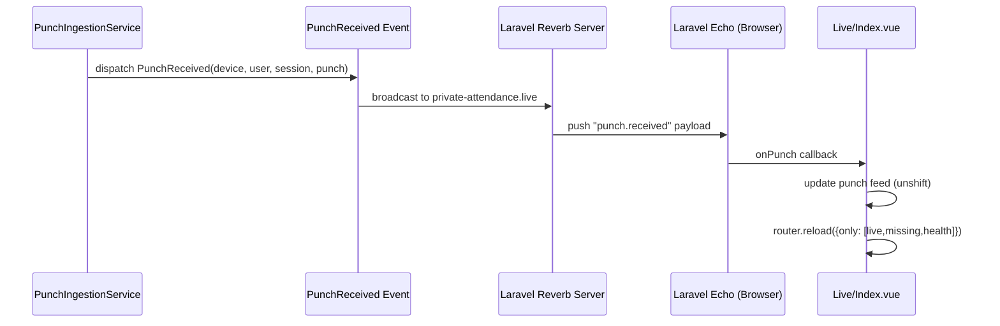
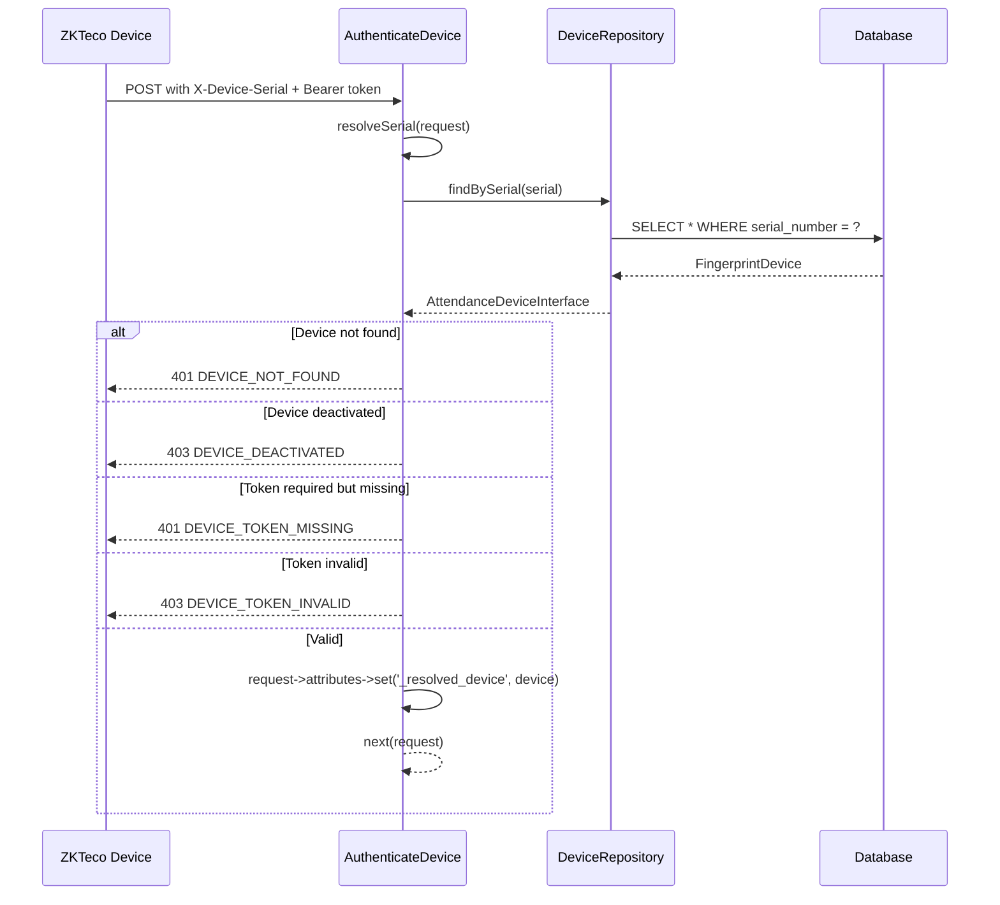

# 2. Sequence Diagrams

## ADMS Push Flow

```mermaid
sequenceDiagram
    participant Device as ZKTeco Device
    participant MW as Middleware
    participant CTRL as DevicePushController
    participant RES as DeviceAdapterResolver
    participant PARSER as ZKTecoAdmsParser
    participant NORM as ZKTecoPunchNormalizer
    participant PIS as PunchIngestionService
    participant DB as Database
    participant AUDIT as AuditLogger
    participant REVERB as Laravel Reverb

    Device->>MW: POST /api/attendance-integration/push/adms<br/>Body: {SN, Body: "ATT\t\tEMP001\t..."}
    MW->>MW: LogDeviceRequest: generate correlation_id
    MW->>MW: AuthenticateDevice: validate serial, token, status
    MW->>CTRL: Forward with _resolved_device

    CTRL->>RES: resolveDriverForDevice(device)
    RES-->>CTRL: driver = "zkteco"
    CTRL->>RES: getParser("zkteco")
    RES-->>CTRL: ZKTecoAdmsParser
    CTRL->>RES: getNormalizer("zkteco")
    RES-->>CTRL: ZKTecoPunchNormalizer

    CTRL->>PARSER: parse(requestBody, headers)
    PARSER-->>CTRL: [{user_id, timestamp, status}, ...]

    CTRL->>AUDIT: logPushReceived(correlationId, serial, rowCount)

    loop For each punch row
        CTRL->>NORM: normalize(rawRow)
        NORM-->>CTRL: NormalizedPunch DTO
        CTRL->>PIS: ingest(device, normalizedPunch)

        PIS->>PIS: resolveUser(deviceUserId)
        alt User found
            PIS->>PIS: guardAgainstDuplicate()
            PIS->>DB: create RawAttendanceLog
            PIS->>DB: create/update AttendanceSession
            PIS->>AUDIT: logPunchIngested()
            PIS->>REVERB: dispatch PunchReceived event
        else User not found
            PIS->>AUDIT: logPunchSkipped()
        else Duplicate
            PIS->>AUDIT: logPunchDuplicate()
        end
    end

    CTRL->>AUDIT: logPushCompleted(correlationId, totals, duration)
    CTRL-->>Device: {success, received, processed, skipped, duplicates}
```

## Attendance Processing (Normalized Punch → Session)

```mermaid
sequenceDiagram
    participant INGEST as PunchIngestionService
    participant USER as Users Table
    participant RAW as RawAttendanceLogs
    participant SESS as AttendanceSessions
    participant EVENT as Event Dispatcher
    participant REVERB as Laravel Reverb

    INGEST->>USER: resolveUser(deviceUserId)
    USER-->>INGEST: User model or null

    alt User not found
        INGEST-->>INGEST: return null
    else User found
        INGEST->>RAW: guardAgainstDuplicate()
        alt Duplicate in 30s window
            INGEST-->>INGEST: throw DuplicatePunchException
        else No duplicate
            INGEST->>RAW: createLog({user_id, device_id, punch_time, ...})
            INGEST->>SESS: checkIn(userId, timestamp, context)
            SESS-->>INGEST: AttendanceSession
            INGEST->>RAW: markProcessed()
            INGEST->>EVENT: dispatch PunchReceived
            EVENT->>REVERB: broadcast to private-attendance.live
            INGEST-->>CTRL: AttendanceSession
        end
    end
```

## Driver Resolution

```mermaid
sequenceDiagram
    participant CTRL as Caller
    participant RES as DeviceAdapterResolver
    participant PROV as ZKTecoProvider
    participant ADPT as ZKTecoAdapter

    CTRL->>RES: getAdapter("zkteco")
    RES->>RES: check registeredProviders["zkteco"]
    RES->>PROV: adapterClass()
    PROV-->>RES: ZKTecoAdapter::class
    RES->>ADPT: new ZKTecoAdapter()
    ADPT-->>RES: instance
    RES-->>CTRL: ZKTecoAdapter instance

    Note over RES,PROV: Subsequent calls return cached instance
```

## Realtime Broadcasting

```mermaid
sequenceDiagram
    participant PIS as PunchIngestionService
    participant EVENT as PunchReceived Event
    participant REVERB as Laravel Reverb Server
    participant ECHO as Laravel Echo (Browser)
    participant VUE as Live/Index.vue

    PIS->>EVENT: dispatch PunchReceived(device, user, session, punch)
    EVENT->>REVERB: broadcast to private-attendance.live
    REVERB->>ECHO: push "punch.received" payload
    ECHO->>VUE: onPunch callback
    VUE->>VUE: update punch feed (unshift)
    VUE->>VUE: router.reload({only: [live,missing,health]})
```

## Authentication Flow

```mermaid
sequenceDiagram
    participant Device as ZKTeco Device
    participant MW as AuthenticateDevice
    participant REPO as DeviceRepository
    participant DB as Database

    Device->>MW: POST with X-Device-Serial + Bearer token
    MW->>MW: resolveSerial(request)
    MW->>REPO: findBySerial(serial)
    REPO->>DB: SELECT * WHERE serial_number = ?
    DB-->>REPO: FingerprintDevice
    REPO-->>MW: AttendanceDeviceInterface

    alt Device not found
        MW-->>Device: 401 DEVICE_NOT_FOUND
    else Device deactivated
        MW-->>Device: 403 DEVICE_DEACTIVATED
    else Token required but missing
        MW-->>Device: 401 DEVICE_TOKEN_MISSING
    else Token invalid
        MW-->>Device: 403 DEVICE_TOKEN_INVALID
    else Valid
        MW->>MW: request->attributes->set('_resolved_device', device)
        MW-->>MW: next(request)
    end
```
