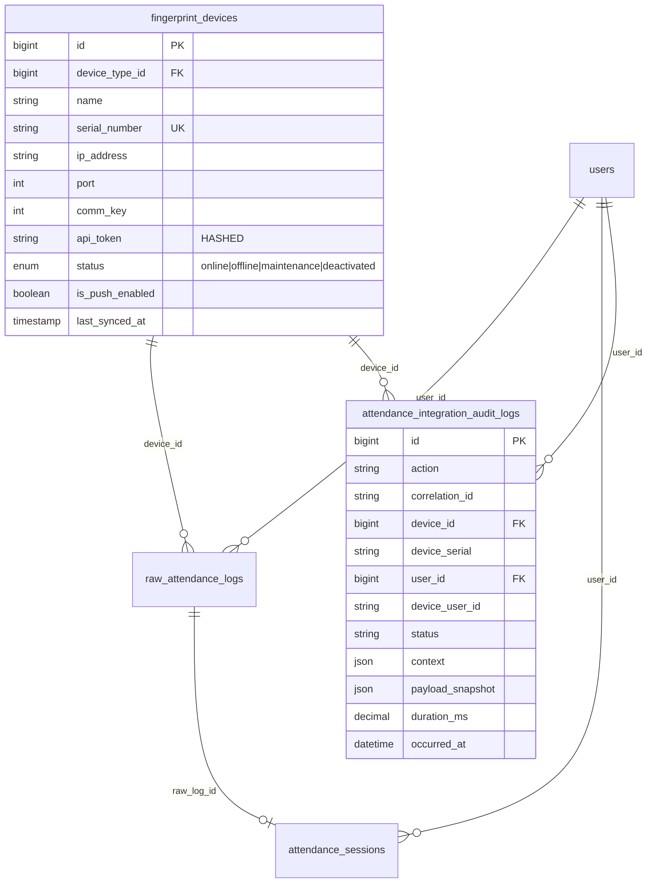

# 3. Database Schema

## Tables Managed by Attendance Integration

### `fingerprint_devices` (column added)

| Column | Type | Description |
|---|---|---|
| `api_token` | VARCHAR(128) NULL | Hashed device authentication token (bcrypt or plain-text during transition) |

**Indexes**: `api_token`

### `attendance_integration_audit_logs`

```sql
CREATE TABLE attendance_integration_audit_logs (
    id BIGINT UNSIGNED AUTO_INCREMENT PRIMARY KEY,
    action VARCHAR(50) NOT NULL,
    correlation_id VARCHAR(64) NULL,
    device_id BIGINT UNSIGNED NULL,
    device_serial VARCHAR(100) NULL,
    user_id BIGINT UNSIGNED NULL,
    device_user_id VARCHAR(100) NULL,
    status VARCHAR(30) NOT NULL,
    context JSON NULL,
    payload_snapshot JSON NULL,
    duration_ms DECIMAL(10,2) NULL,
    ip_address VARCHAR(45) NULL,
    occurred_at DATETIME NOT NULL,
    created_at TIMESTAMP NULL,
    updated_at TIMESTAMP NULL,

    INDEX idx_correlation (correlation_id),
    INDEX idx_device (device_id),
    INDEX idx_action_occurred (action, occurred_at),
    INDEX idx_device_occurred (device_id, occurred_at),
    INDEX idx_status_occurred (status, occurred_at),

    FOREIGN KEY (device_id) REFERENCES fingerprint_devices(id) ON DELETE SET NULL,
    FOREIGN KEY (user_id) REFERENCES users(id) ON DELETE SET NULL
);
```

### `raw_attendance_logs` (indexes added)

| Index Name | Columns | Purpose |
|---|---|---|
| `idx_raw_logs_dedup` | `(device_id, device_user_id, punch_time)` | Duplicate punch detection |
| `idx_raw_logs_user_time` | `(device_user_id, punch_time)` | User punch history lookups |

### Audit Actions Reference

| Action | Status | Description |
|---|---|---|
| `push_received` | `received` | New push payload arrived |
| `push_completed` | `completed` | Push processing finished |
| `push_failed` | `failed` | Push processing failed |
| `punch_ingested` | `success` | Punch successfully created session |
| `punch_duplicate` | `duplicate` | Punch rejected as duplicate |
| `punch_skipped` | `skipped` | Punch skipped (user not found) |

## ER Diagram


